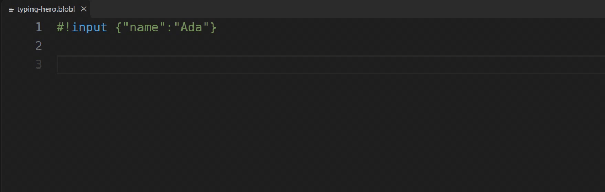
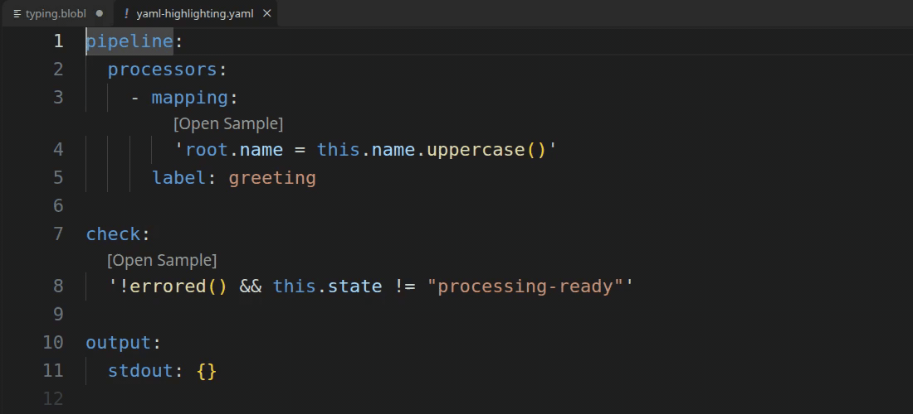
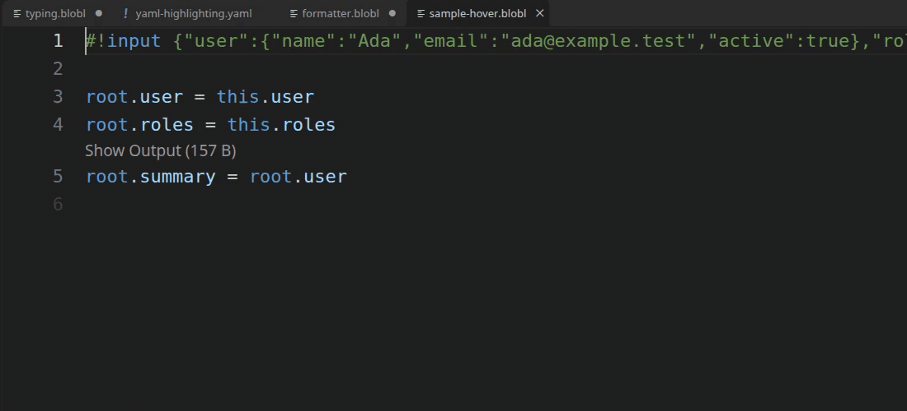
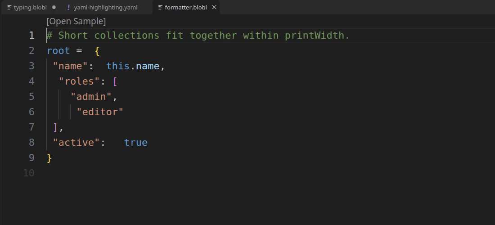
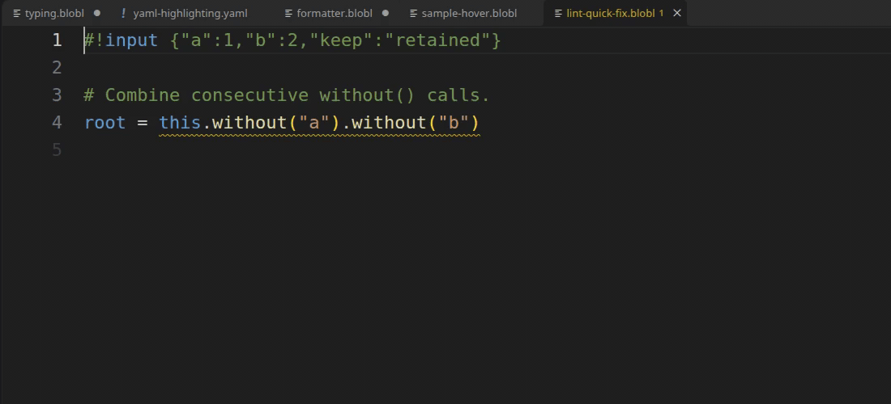

# Bloblang Language Server

A single Go LSP binary for Bloblang and mappings embedded in Redpanda Connect YAML. Diagnostics, formatting, completion, hover previews, navigation and linting live in the server and are available to LSP clients. The [VS Code extension](https://github.com/teyfix/vscode-bloblang) supplies editor integration and highlighting, downloads and extracts the latest server release archive, and caches the executable for later starts.



## Try it in VS Code

Install [Bloblang for VS Code](https://marketplace.visualstudio.com/items?itemName=teyfix.vscode-bloblang), then open a `.blobl`, `.bloblang` or Redpanda Connect YAML file. The extension manages the server automatically; no Go toolchain or manual server installation is needed. To use a local build, set `bloblang.server.path` to its executable.

The demos below show the server in action through the VS Code extension. Each focuses on a separate feature.

### Embedded YAML mappings

Highlighting, diagnostics, completion, hover and navigation work inside recognized YAML mapping values, including quoted scalars and literal/folded blocks. Run **Bloblang: Format Embedded Mappings** from the Command Palette to format those values while preserving surrounding YAML. Short scalars keep their style; values that wrap become literal blocks. Changed folded blocks also become literal blocks. `${! ... }` interpolations receive language features but are not formatted. Embedded server features require valid host YAML.



## Editor features

- Benthos syntax and semantic diagnostics, plus nonblocking sample problems.
- Formatting that preserves tokens, comments and string content; malformed syntax is left unchanged.
- Function and method documentation, sampled field/expression values, before-assignment `root` previews, and output inlay tooltips.
- Definition and references for local variables and named maps (including literal `.apply("name")` calls), import paths and YAML `mapping: from "path"` links.
- Rename local variables, lambda parameters and named maps with **F2** in VS Code, including embedded YAML and imported maps. See [rename support and scope](docs/features/rename.md).
- Function/method snippets, local variable/metadata completion, and sampled receiver guidance. Method filtering applies only when a valid sample yields a reliable receiver value; otherwise all static completions remain available.
- YAML literal, folded, plain and quoted mappings under `mapping`, `request_map`, `result_map`, `args_mapping`, `fields_mapping`, `check` and `bloblang`, plus `${! ... }` expressions. Host YAML formatting is preserved; use the extension's explicit **Format Embedded Mappings** command.

Each embedded mapping is evaluated independently. A sample describes that mapping's input; the server does not infer intermediate processor inputs from a pipeline. Hover inside reached `if` branches retains branch conditions and preceding statements. Named maps and per-element/lambda contexts with no selected invocation do not show invented runtime values.

## Samples

Provide sample input to inspect values while editing, without running a pipeline. Hover `this`, assignment targets, variables and supported expressions; assignment end hints show output after each statement. In VS Code, **Show Input** and **Show Output** lenses open full previews for larger values.



For `mapping.blobl`, the default is a sibling `mapping.sample.json`, `.yaml` or `.yml`. Files must have a `$bloblang` envelope:

```json
{"$bloblang":{"input":{"name":"Ada"},"meta":{"topic":"people"}}}
```

```yaml
$bloblang:
  input:
    name: Ada
  meta:
    topic: people
```

`input` is required and may be `null`. `meta` is optional and must be an object. Multiple siblings are ambiguous; select an entire sample explicitly. Missing default files produce an Information issue suggesting a sample; missing explicit files, malformed samples and bad directives produce Error issues. These issues disable dynamic previews and leave static diagnostics, formatting, completions and navigation available.

Leading comment directives are dispatched through an internal handler registry:

```bloblang
#!input {"name":"Ada"}
#!meta {"topic":"people"}
root.name = this.name.uppercase()
```

`#!sample {input: {name: Ada}, meta: {topic: people}}` supplies an entire inline sample, without the `$bloblang` envelope. It overrides automatic sibling discovery, including invalid or ambiguous default files. Partial `input` and `meta` directives override their fields in a valid default sample, in document order.

`input_from`, `meta_from`, `sample_from` and `root_from` load JSON/YAML files. **Every `_from` file requires the `$bloblang` envelope**; each handler extracts its corresponding field. Paths resolve relative to the mapping or host YAML file. Sample/import changes refresh open mappings.

Multiline bodies remain valid Bloblang comments:

```bloblang
#!sample |
#| input:
#|   name: Ada
#| meta:
#|   topic: people
root.name = this.name
```

A body ends when `#|` continuation lines end. Empty arguments, unknown directives and duplicate directive names are errors at the header. Directives belong before mapping statements.

For `result_map` overlays, optional `$bloblang.root` or `#!root` seeds a separate output target. This selects Benthos `BloblangMutateFrom`, while `this` continues to read `input`:

```bloblang
#!input {"result":{"video":"ready"}}
#!root {"provider_file_ref":"video"}
root.status = this.result.get(root.provider_file_ref)
```

Metadata enters a public `service.Message`, so `meta("topic")` and `@topic` work. Metadata assignments update preview output metadata. Each prefix starts from a fresh sample. The first assignment's left-hand `root` tooltip shows the input (or explicit target); later left-hand tooltips show the prior prefix output. Right-hand `root` follows Benthos's current output semantics and can be uninitialized before the first assignment. `this` retains the input within that mapping.

IDE validation and sample execution use an isolated `env()` resolver: a whole sample's optional `env` object supplies explicit string values, and every unspecified name evaluates to `""`. The resolver never reads or changes the language server's process environment. This keeps concatenations such as `"email=" + env("MIXDROP_API_EMAIL")` evaluable in the editor. Real Bloblang still returns null for unset variables, so the environment fallback lint warning remains.

```yaml
$bloblang:
  input:
    provider_file_ref: fixture-ref
  env:
    MIXDROP_API_EMAIL: example@example.test
    SUBTITLE_FILE: /tmp/fixture.srt
```

Use fixture values in these overrides. They apply to whole samples loaded automatically, through `#!sample_from`, or inline through `#!sample {input: ..., env: {...}}`. Empty placeholders can take different `.or(...)`, `.catch(...)`, or null-check paths from the real runtime; previews are not a substitute for production validation.

Migration from the old sample syntax: change `#!sample {"name":"Ada"}` to `#!input {"name":"Ada"}`, or `#!sample {"input":{"name":"Ada"}}`. Wrap old raw sample files under `$bloblang.input`.

## Build and package

Requires Go 1.26.3+ and a C compiler. The grammar is pinned to a published Go module commit, so builds work from this repository alone. Tree-sitter's Go binding uses generated C; release binaries need no source checkout or compiler at runtime.

```sh
go test ./...
go build -a -o target/bloblang-lsp ./cmd/bloblang-lsp
```

To develop against the sibling grammar, use `go mod edit -replace github.com/teyfix/tree-sitter-bloblang=../tree-sitter-bloblang` locally and remove that replacement before committing. Use `-a` after regenerating its grammar: the included `parser.c` lives outside the Go package directory and Go's normal package cache can miss the change.

Tagged releases publish `bloblang-lsp-<os>-<arch>` binaries (`.exe` on Windows), matching `language-server-v<version>-<os>-<arch>` tar/ZIP archives, and `SHA256SUMS` for Linux, macOS and Windows on amd64 and arm64. The VS Code extension downloads and extracts the latest matching archive. The server binary itself is not compressed at runtime. A configured external binary can also be used for development.

To verify a private mapping corpus without changing files:

```sh
BLOBLANG_CORPUS_LIST=/path/to/newline-delimited-files.txt go test ./internal/lsp -run TestFormatterCorpus -v
```

The server implements full document sync, completion, hover, formatting, definition, references, diagnostics, inlay hints, code lenses and lint Quick Fixes. Both CLI entrypoints write logs to stderr and speak LSP on stdin/stdout. Workspace editor settings use `.bloblangrc.json` as shown below. Legacy server startup settings use the `.bloblangrc` base name with supported extensions (for example `.bloblangrc.yaml`) and `BLOBLANG_LSP_*` overrides; see [configuration](docs/core/settings.md). Startup settings require restarting and do not set preview print width.

## Workspace formatting, previews and linting

Each workspace root can contain `.bloblangrc.json`. Multi-root workspaces use the longest matching root; standalone documents use their parent directory. Edits, creation and deletion take effect without restarting. Invalid settings fall back to defaults and the bundled VS Code schema reports invalid keys or values.

```json
{
  "formatter": { "printWidth": 80 },
  "preview": { "format": "yaml" },
  "lint": {
    "enabled": true,
    "rules": {
      "correctness/environment/require-fallback": "warn",
      "correctness/variables/no-unused-let": "warn",
      "style/assignments/prefer-grouped": { "severity": "warn", "minAssignments": 3 },
      "style/objects/prefer-with": "hint",
      "style/objects/prefer-without": "warn",
      "style/objects/combine-without": "warn",
      "style/arrays/prefer-any": "hint"
    }
  }
}
```

See the [generated rule reference](docs/features/lint-rules.md) for defaults and fix availability. Rule keys stay flat for autocomplete. All rules accept `off`, `hint`, `info`, `warn` or `error`, either as a string or an object with `severity`. `minAssignments` is specific to grouped assignments. Metadata, defaults and schema properties live in `internal/editorconfig`; regenerate the bundled schema with `go run ./cmd/config-schema > schemas/bloblangrc.schema.json`.

### Formatting and previews

Use **Format Document** in a Bloblang file or **Bloblang: Format Embedded Mappings** in YAML. The formatter preserves tokens, comments, string contents and explicit parentheses. It collapses short expression groups, expands longer groups, and verifies its output with Tree-sitter and Benthos before offering edits. Long method chains break after dots; lambda bodies can wrap independently while short calls such as `.join("; ")` stay together. YAML mappings preserve short scalar styles where valid; multiline output uses literal blocks. Formatting does not apply lint refactors.

```bloblang
root = this.cast.map_each(c -> c.
  with("character", "name").
  values().
  filter(cn -> cn.or("") != "").
  join(" – ")
).join("; ")
```



Hover values, inlay tooltips and Show Output share YAML previews by default. Set `preview.format` to `json` for compact JSON. Both use `formatter.printWidth`; inline labels have their own size limit. An unset `env()` is null, so `.catch(...)` alone does not satisfy the environment rule. Use `.or(default)`, `.or(throw("required"))`, or `.not_null().catch(throw("required"))`.

### Lint suggestions and Quick Fixes

Lint suggestions account for object merge/replacement, missing fields and effectful evaluation. Grouped assignments, projections, deletion and existence checks are advisory. Consecutive `.without()` calls with literal arguments have an explicit Quick Fix. The server does not implement `source.fixAll`; formatting does not apply lint refactors. See [lint behavior and fixes](docs/features/lint.md).



```bloblang
# bloblang-lint-disable-next-line correctness/environment/require-fallback -- optional value
root.optional = env("OPTIONAL")
```

### Selecting samples for embedded YAML

Inline YAML mappings are numbered in document order from 001, excluding interpolation and external `from` mappings. An immediately adjacent comment at the mapping key's indentation selects a sample explicitly:

```yaml
# bloblang-sample: selected.sample.json
check: |
  !errored()
```

Selection prefers that path, then `config.sample-001.json` (also `.yaml` or `.yml`), then shared `config.sample.json`. The `$bloblang` envelope applies to every sample file. Missing explicit files are errors; missing automatic samples remain informational and leave static features usable.
