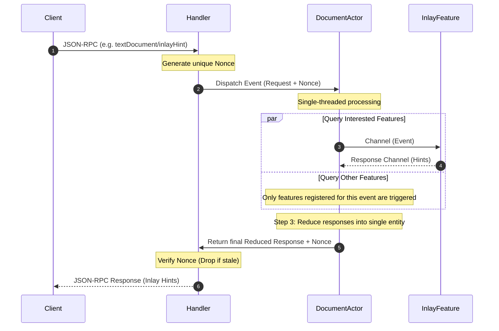

# System Specification: Concurrency & Event Lifecycle Model

This document specifies the concurrency model, event dispatch pipeline, and thread-safety design of the `bloblang-lsp` server.

---

## 1. The Mutex-Free Architecture Goal

To prevent deadlocks, resource contention, and race conditions, the language server minimizes the use of raw `sync.Mutex` structures. Instead, it relies on a **Hierarchical Actor Model** using Go channels to synchronize and serialize state:

```
[Handler] 
   |
   | (Unbuffered Channel: Job Request + Nonce)
   v
[Document Actor] (One single-threaded goroutine per document)
   |
   +---> (Channels) ---> [Feature: Diagnostics] ---\
   +---> (Channels) ---> [Feature: Inlay Hints]  ===> (Reduce Channels) ---> [Reducer] ---> [Response Channel]
   +---> (Channels) ---> [Feature: Code Lenses]  ---/
```

---

## 2. Detailed Event Lifecycle Flow

Every JSON-RPC request or notification goes through a structured, phased pipeline:



### Phase 1: Handler Event Capture
* The handler receives the incoming JSON-RPC call.
* For notifications (e.g. `DidOpen`, `DidChange`), the handler performs local changes in the `document.Store` and posts a message to the corresponding document's actor.
* For synchronous queries (e.g. `Hover`, `InlayHint`), the handler generates a unique transaction transaction identifier (**nonce**), wraps the parameters, and posts it to the target Document Actor's queue.

### Phase 2: Single-Threaded Document Actor
* Each active document URI has its own dedicated **Document Actor** goroutine.
* This actor reads events sequentially from its input channel, guaranteeing that state changes (such as AST parsing updates or text mutations) are processed in strict chronological order.
* There is **no concurrent state mutation**, eliminating the need for reader/writer locks on the document instance.

### Phase 3: Concurrent Feature Dispatch
* The Document Actor determines which features are registered/interested in the incoming event.
* It fires off processing requests strictly to interested features concurrently.
* Features consume these events via input channels, execute their isolated business logic (always under 5ms), and reply with their results over individual response channels.

### Phase 4: Reduction & Nonce Filtering
* The actor gathers all feature responses and **reduces** them into a single, unified structure.
* The reduced output is dispatched back to the handler along with the original **nonce**.
* **Stale Message Dropping**: If multiple edits have arrived rapidly, the handler uses the nonce to ensure it only answers the client's most current request. Older, outstanding nonces are quietly dropped to prevent stale results from overwriting newer states.

### Phase 5: Return / Publish
* **Synchronous Calls**: The handler sends the reduced response back directly in the JSON-RPC reply.
* **Asynchronous Notifications**: For events that do not block client queries (like validation results), the Document Actor publishes the merged results using the LSP client adapter API.

---

## 3. Implementation Rules & Constraints

### What is EXPECTED
* **Nonce Validation**: The handler must maintain a tracking registration of outstanding nonces. When a response is received, it must verify the nonce's freshness and drop any outdated payloads.
* **Clean Feature Subscriptions**: Features must declare their interest list (e.g., subscribing to `DidChange` but ignoring `Hover`) during the initialization handshake.

### What is FORBIDDEN
* **No Shared Mutable State across Actors**: Document Actors must never share pointers to un-snapshotted document structures or AST trees.
* **No Direct Mutex Locking inside Feature Code**: Features must read from their channels, process parameters locally on the stack, and return outputs over their response channel.
