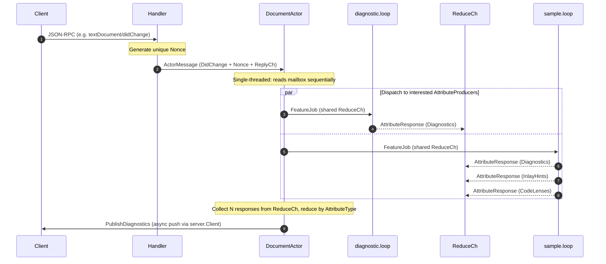

# System Specification: Concurrency & Event Lifecycle Model

This document specifies the concurrency model, event dispatch pipeline, and thread-safety design of the `bloblang-lsp` server.

---

## 1. The Mutex-Free Architecture Goal

To prevent deadlocks, resource contention, and race conditions, the language server minimizes the use of raw `sync.Mutex` structures. Instead, it relies on a **two-level Hierarchical Actor Model** using Go channels to synchronize and serialize state:

```
[Handler] 
   |
   | (Buffered Channel: ActorMessage + Nonce)
   v
[Document Actor goroutine] (One per open document URI)
   |
   +---> feature.Dispatch(FeatureJob) ---> [diagnostic goroutine] (owns its own state) ---\
   +---> feature.Dispatch(FeatureJob) ---> [sample goroutine]    (owns its own state) ====> (Reduce Channel) ---> [Actor Reducer] ---> [Response/Publish]
   |
   +---> feature.Query(QueryJob)      ---> [hover goroutine]      (owns its own state) ----> (Single ReplyCh) ---> [Actor]
   +---> feature.Query(QueryJob)      ---> [completion goroutine] (owns its own state) ----> (Single ReplyCh) ---> [Actor]
```

Each feature goroutine is constructed **per document** by its `DocumentActor`. Because features are document-scoped, they never share state across documents and never need to guard against inter-document races.

---

## 2. Detailed Event Lifecycle Flow

Every JSON-RPC request or notification goes through a structured, phased pipeline:



### Phase 1: Handler Event Capture
* The handler receives the incoming JSON-RPC call.
* For notifications (e.g. `DidOpen`, `DidChange`), the handler performs local changes in the `document.Store` and posts a message to the corresponding document's actor.
* For synchronous queries (e.g. `Hover`, `InlayHint`), the handler generates a unique transaction transaction identifier (**nonce**), wraps the parameters, and posts it to the target Document Actor's queue.

### Phase 2: Single-Threaded Document Actor
* Each active document URI has its own dedicated **Document Actor** goroutine.
* This actor reads events sequentially from its input channel, guaranteeing that state changes (such as AST parsing updates or text mutations) are processed in strict chronological order.
* There is **no concurrent state mutation**, eliminating the need for reader/writer locks on the document instance.

### Phase 3: Concurrent Feature Dispatch
* The Document Actor determines which `AttributeProducer` features are registered for the incoming event (via `InterestedEvents()`).
* It calls `feature.Dispatch(FeatureJob)` on each interested feature concurrently, sending jobs into each feature's mailbox channel. The `FeatureJob` carries the shared reduce channel as its `ReplyCh`.
* Each feature goroutine — which **exclusively owns** all its internal mutable state — processes the job, then writes one `AttributeResponse` per produced attribute onto the shared reduce channel.
* Because each feature is a separate goroutine owning separate state, concurrent dispatch is race-free by confinement — not by locking.

### Phase 4: Reduction & Nonce Filtering
* The actor gathers all feature responses and **reduces** them into a single, unified structure.
* The reduced output is dispatched back to the handler along with the original **nonce**.
* **Stale Message Dropping**: If multiple edits have arrived rapidly, the handler uses the nonce to ensure it only answers the client's most current request. Older, outstanding nonces are quietly dropped to prevent stale results from overwriting newer states.

### Phase 5: Return / Publish
* **Synchronous Calls**: The handler sends the reduced response back directly in the JSON-RPC reply.
* **Asynchronous Notifications**: For events that do not block client queries (like validation results), the Document Actor publishes the merged results using the LSP client adapter API.

---

## 3. Implementation Rules & Constraints

### What is EXPECTED
* **Nonce Validation**: The handler must maintain a per-URI tracking of the latest outstanding nonce. When a response is received from the actor, it verifies nonce freshness and drops any outdated payloads.
* **Clean Feature Subscriptions**: Each `AttributeProducer` feature declares its interest list via `InterestedEvents()` — the actor filters on this at dispatch time.
* **Two-Level Goroutine Hierarchy**: The actor goroutine and each feature goroutine are independent. The actor is the dispatcher and reducer; features are the processors. Neither level enters the other's domain.
* **Per-Document Feature Instances**: All feature goroutines are constructed fresh at `DidOpen` and terminated at `DidClose`. No feature state persists or is shared across document lifetimes.

### What is FORBIDDEN
* **No Shared Mutable State across Actors**: Document Actors must never share pointers to un-snapshotted document structures or AST trees.
* **No Direct Mutex Locking inside Feature Code**: Features receive jobs via their mailbox channel, process them entirely on local/owned state, and write results to `job.ReplyCh`. `sync.Mutex` must never appear in a feature package.
* **No Feature Logic in Actor**: The actor dispatches and reduces. It does not parse ASTs, evaluate expressions, or inspect document content.
* **No Cross-Feature Communication**: Feature goroutines must never send messages to each other. All information flows through the actor.
