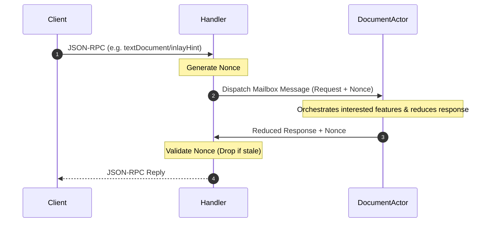

# Module Specification: JSON-RPC Handler (`handler.go`)

This document specifies the design, event routing, and capability registration standards of the **Handler** package (`internal/handler/handler.go`).

---

## 1. Overview & Purpose

The `handler` module is the top-level gateway of the language server. It is a **pure JSON-RPC translation and communication bridge** that maps standard LSP requests (e.g., hover, completions, inlay hints) directly into actor-mailbox messages. 

It is completely decoupled from feature orchestration, holding **no features, no AST parsing logic, and no diagnostic states**. It only communicates with the single-threaded `DocumentActor` matching the target file URI, receiving reduced responses to reply directly to the client or publishing push notifications (like diagnostics) upon receiving actor-triggered directives.

---

## 2. Structural Interface Flow



---

## 3. Structural Design & Responsibilities

The `Handler` struct retains only standard plumbing and the document manager/actor map:

```go
type Handler struct {
    config          *settings.Config
    logger          *slog.Logger
    client          *server.Client
    documents       *document.Store
    manager         *document.Manager // Routes messages to specific Document Actors
}
```

### Key Responsibilities

#### 1. LSP Hook Delegation
* **DidOpen / DidChange / DidClose**: Mutates document text in the shared `document.Store`, and routes corresponding lifecycle notifications straight into the mailbox of the target document's `DocumentActor`.
* **Completion / Hover / InlayHint / CodeLens**: Translates RPC parameters, generates a transaction nonce, registers a synchronous response channel, sends the request to the document's actor channel, and awaits the final response.
* **ExecuteCommand**: Passes client command invocations (like `bloblang/showResult`) straight to the appropriate actor for evaluation.

#### 2. Bidirectional Client Binding
* Implements `SetClient(client *server.Client)` to capture the RPC connection, which is passed into the Document Actors upon startup so they can proactively push async diagnostics notifications to the client.

#### 3. Initialize Capability Handshake
* Handles the standard capabilities negotiation with the client, advertising supported sync schemas (`SyncFull`), trigger characters, and commands.

---

## 4. Key Constraints & Rules

### What is EXPECTED
* **Zero Feature awareness**: The handler must remain 100% blind to feature logic. If we add new features (e.g. formatting or document symbols), `handler.go` should only require registering the static capability and passing the RPC parameters down to the actor.
* **Synchronous Channel Awaiting**: The handler blocks on the actor's synchronous response channel. Because the actor delegates and reduces features under 5ms, this synchronous waiting is highly performant and non-blocking to other file actors.

### What is FORBIDDEN
* **No Feature Adaptors / Adapters**: Never import or keep references to diagnostics, inlay hints, completions, or hover structs in the `Handler`.
* **No Intermediate Logic / Parsing**: Do not perform string matching, regex checking, AST traversal, or directory searching in the handler. The handler merely packs raw RPC structs into actor jobs.
