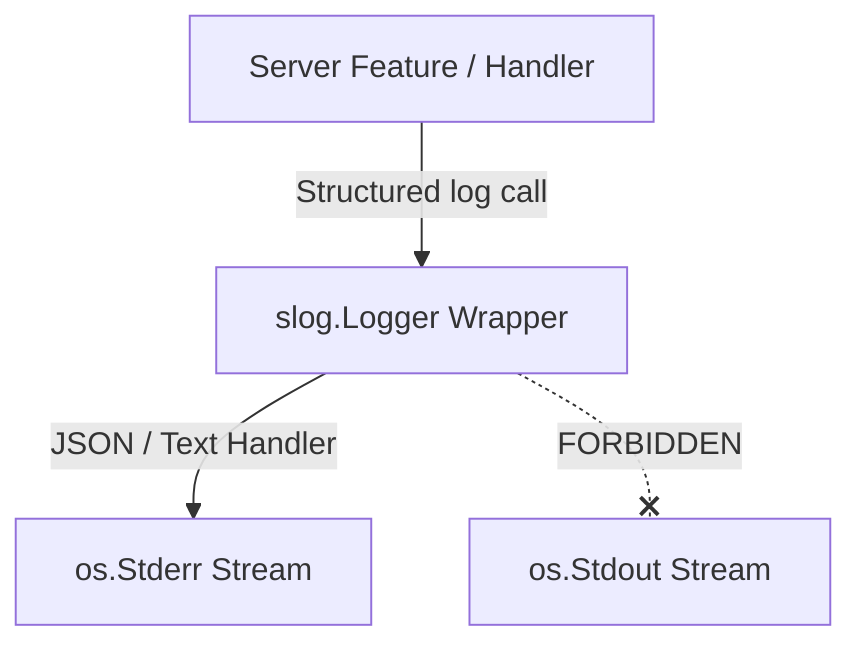

# Module Specification: Telemetry & Logging (`logger.go`)

This document specifies the design, logging standards, and constraints of the **Telemetry** package (`internal/telemetry/logger.go`).

---

## 1. Overview & Purpose

The `telemetry` package provides the logging system for the language server. It wraps the standard Go `log/slog` structured logging engine, configuring levels and routing data correctly to facilitate diagnostics and system monitoring without disrupting the client editor interface.

---

## 2. Structural Logging Architecture

---

## 3. Implementation Specifications

### 1. The Stdio Isolation Constraint
* **The Rule**: All logs MUST be output to `os.Stderr`.
* **Why**: The LSP client communicates with the server over `os.Stdout` (for standard Stdio JSON-RPC transport). If any debug statements or warnings spill into standard output, the client's RPC parser will crash due to invalid JSON payload sequences.

### 2. Log Levels Mapping
The log level configuration supports four primary tiers, matching `slog.Level`:
* `slog.LevelDebug` ("debug"): Detailed execution logs (e.g. AST parsing trees, Benthos execution durations, JSON payload dumps).
* `slog.LevelInfo` ("info"): Server lifecycle indicators (e.g. server initialized, document opened, document closed).
* `slog.LevelWarn` ("warn"): Recoverable irregularities (e.g. failing to open relative sample files, parsing a corrupt directive comment).
* `slog.LevelError` ("error"): Critical failures (e.g. failed to parse port configurations, fatal parser initialization errors).

### 3. Contextual Attribute Guidelines
Always append contextual structured fields instead of formatting them into the log string:
* **Correct**: `logger.Error("failed to parse document", "uri", docURI, "error", err)`
* **Incorrect**: `logger.Error(fmt.Sprintf("failed to parse document %s: %s", docURI, err))`

---

## 4. Key Constraints & Rules

### What is EXPECTED
* **JSON/Text Format Selection**: Supported log output in either Text format (for human readability in stderr consoles) or JSON format (for production logs ingestions).
* **Thread-Safety**: The instantiated `slog.Logger` must be thread-safe, supporting concurrent writes from multiple asynchronous goroutines processing features.

### What is FORBIDDEN
* **No `os.Stdout` routing**: Under no circumstances should the logging engine target standard output.
* **No blocking write calls**: Logging should never block the execution pathway of time-critical LSP queries (e.g., autocomplete queries).
