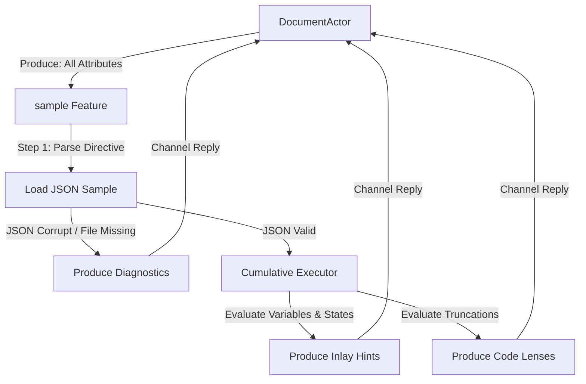

# Feature Specification: Sample Feature (`sample.go`)

This document specifies the design, cumulative execution caching, and multi-attribute output rules of the **Sample** feature (`internal/feature/sample/`).

---

## 1. Overview & Purpose

The `sample` feature is the core runtime execution engine of the language server. It parses sample directives (`#!sample` or `#!sample_from`), loads the corresponding JSON inputs, and runs cumulative statement evaluations of Bloblang assignments using the custom executor. 

It acts as a multi-attribute contributor, simultaneously producing **Diagnostics**, **Inlay Hints**, and **Code Lenses**.

---

## 2. System Orchestration & Multi-Attribute Flow

---

## 3. Implementation Specifications

### 1. Registration
* **Interested Events**: `DidOpen`, `DidChange`.
* **Produced Attributes**: `AttributeDiagnostics`, `AttributeInlayHints`, `AttributeCodeLenses`.

### 2. Sample Extraction & Directive Validation
* Scan the top lines of the document for comments matching:
  * `#!sample <raw_json_string>`: Parse the inline JSON string.
  * `#!sample_from <relative_path>`: Read and parse the target relative JSON file from the filesystem.
* **Diagnostics Contribution**: If the JSON is invalid, or if the relative file is missing, generate a diagnostic on the directive comment line with `SeverityWarning`, `Source = "bloblang"`, stating the parsing or filesystem error.

### 3. Inlay Hints Contribution
If a valid sample exists, traverse the AST and compute inline annotations:
* **Directive Hint**: Render ` = <short_json>` at the end of the comment, with a tooltip containing the complete pretty-printed JSON structure.
* **Before-Assignment Hint**: For each `root_assignment` statement, query `h.executor.ExecuteCumulative(...)` up to the preceding statement index. Renders `: <short_value>` at the end of the `root` keyword.
* **After-Assignment Hint**: Query the cumulative executor up to the current statement index. Renders ` = <short_value>` at the end of the statement node.
* **Value Shortening Rules**: Use standard JSON marshalling, truncate strings exceeding `MaxInlineResultBytes` by appending the ellipsis `…`, and generate detailed pretty-printed JSON structures in the hover tooltips.

### 4. Code Lenses Contribution
* **Open Sample Link**: If `#!sample_from <path>` is used, generate a `[Open Sample]` lens on the comment line that maps to the `bloblang/openFile` command, passing the absolute target URI.
* **Input / Output Lenses**: If the cumulative result of a statement exceeds `MaxInlineResultBytes` (meaning it was truncated in the inlay hint), generate `Show Input (size)` and `Show Output (size)` lenses at the beginning of the assignment line mapping to the `bloblang/showResult` command.

---

## 4. Key Constraints & Rules

### What is EXPECTED
* **Unified State Consistency**: The sample extraction, execution cache lookup, and attribute outputs must be synchronized to ensure inlay hints, code lenses, and diagnostics are perfectly aligned and do not render mismatched states.
* **Fast Caching**: Use the `PartialExecCache` to avoid re-evaluating the entire script on minor cursor changes, ensuring cumulative evaluations complete in microseconds.

### What is FORBIDDEN
* **No Direct File System Modifying**: The feature must only read files from the filesystem; it never writes or deletes them.
* **No Nonce Interference**: The feature does not manage nonces; it simply receives the transaction nonce from the actor and passes it back on the reply channel.
