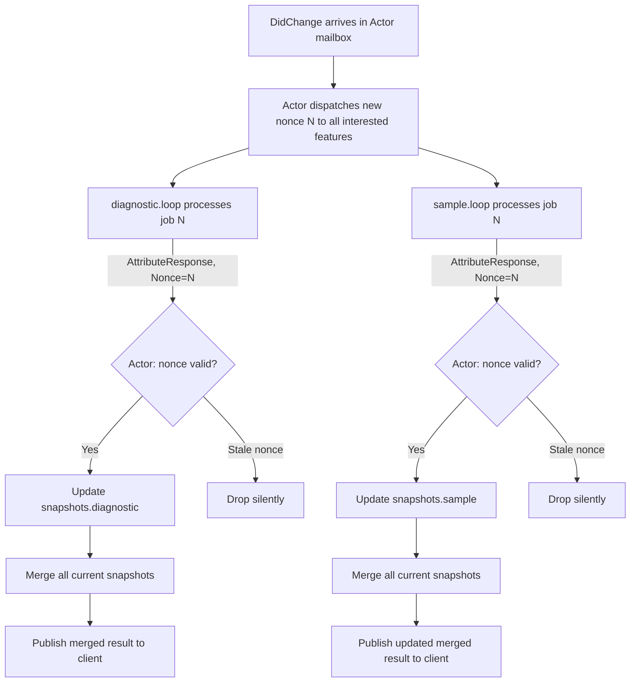

# System Specification: Generic Attribute API & Reduction Model

This document specifies the **Generic Attribute API**, the **Streaming Reduction Model**, and the **Direct Channel Sync** communication pattern used to integrate and orchestrate features inside the `DocumentActor`.

---

## 1. Overview & Objective

To prevent features from tightly coupling with the `DocumentActor` orchestrator, we define a highly generic, extensible, and clean interface: the **Generic Attribute API**.

This API allows multiple separate features (for example, the `diagnostic` feature and the `sample` feature) to independently generate the same document attributes (like `Diagnostics`). The `DocumentActor`:
- Dispatches to features **non-blocking** (drain-and-replace mailbox pattern).
- Receives feature replies **asynchronously** via persistent per-feature reply channels.
- **Reduces over time** as replies arrive — publishing immediately on each new valid reply — rather than waiting for all features to finish.
- Holds a **per-feature snapshot** of the last valid result, merged on every update, preventing flicker.

---

## 2. Feature Goroutine & Mailbox Model

### Core Principle: Each Feature is a Self-Contained Goroutine

Every feature is a running goroutine that owns all of its internal mutable state exclusively. This is the **confinement pattern**: because only one goroutine ever reads or writes a feature's state, no mutex is ever needed inside a feature package.

**Construction contract:**
* Features are constructed by the `DocumentActor` at `DidOpen` time — **one instance per open document**.
* Because features are document-scoped, they never need to guard against inter-document race conditions.
* At construction, the feature allocates its mailbox channel, initializes its internal state, and launches its `loop()` goroutine.
* The actor holds a **persistent reply channel** (`chan AttributeResponse`) per feature, created at construction and passed to the feature. The feature always writes results to this same channel.

```go
// Constructed once per document by DocumentActor.
// replyCh is created by the actor and kept for the actor's select loop.
func NewDiagnosticFeature(replyCh chan<- AttributeResponse, /* other deps */) *DiagnosticFeature {
    f := &DiagnosticFeature{
        mailbox: make(chan FeatureJob, 1), // capacity 1: drain-and-replace
        replyCh: replyCh,
        // initialize internal state
    }
    go f.loop()
    return f
}

func (f *DiagnosticFeature) loop() {
    for job := range f.mailbox {
        results := f.process(job)      // purely internal — reads/writes f.* fields
        for _, r := range results {
            r.Nonce = job.Nonce        // echo nonce for actor staleness check
            f.replyCh <- r
        }
    }
}
```

### Encapsulation Rule (STRICT)

> [!IMPORTANT]
> **No feature logic, no feature-internal types, and no feature state must be visible outside its own package.** The `DocumentActor` interacts with a feature only through the `AttributeProducer` or `QueryFeature` interface — never by importing the feature's concrete types or calling its methods directly.

---

## 3. The Generic Attribute API

### Dispatch Types

```go
package feature

type AttributeType string

const (
    AttributeDiagnostics AttributeType = "diagnostics"
    AttributeInlayHints  AttributeType = "inlayhints"
    AttributeCodeLenses  AttributeType = "codelenses"
)

// FeatureJob is sent into an AttributeProducer's mailbox.
// It carries the actor's current dispatch nonce so the actor can detect stale replies.
type FeatureJob struct {
    Event   meta.HandlerEvent
    Payload EventPayload
    Nonce   uint64 // current actor nonce at dispatch time
}

// AttributeResponse carries one attribute result from one feature.
// The feature echoes the job's Nonce so the actor can validate freshness.
type AttributeResponse struct {
    Feature string        // name of the feature that produced this response
    Type    AttributeType
    Value   any           // e.g. []protocol.Diagnostic, []protocol.InlayHint
    Nonce   uint64        // echoed from FeatureJob.Nonce
    Err     error
}
```

### `AttributeProducer` Interface

```go
// AttributeProducer is implemented by each async, state-contributing feature.
// The actor interacts with it exclusively through Dispatch and Close.
// The reply channel is registered at construction — the actor select-loops over it permanently.
type AttributeProducer interface {
    Name() string

    // List of events this feature subscribes to.
    InterestedEvents() []meta.HandlerEvent

    // Attribute types this feature contributes.
    ProducedAttributes() []AttributeType

    // Dispatch sends a FeatureJob into the feature's capacity-1 mailbox.
    // If a pending unprocessed job exists, it is drained and replaced (drop-and-replace).
    // This is always non-blocking from the actor's perspective.
    Dispatch(job FeatureJob)

    // Close signals the feature goroutine to stop. Called by DocumentActor at DidClose.
    Close()
}
```

### Drain-and-Replace Dispatch Pattern

The `Dispatch` method uses a **drain-and-replace** pattern on the capacity-1 mailbox to ensure the latest job always wins without blocking the actor:

```go
func (f *Feature) Dispatch(job FeatureJob) {
    // Drain any unprocessed pending job (non-blocking).
    select {
    case <-f.mailbox:
    default:
    }
    // Send the new job. This always succeeds immediately (mailbox was just drained or was already empty).
    f.mailbox <- job
}
```

> [!NOTE]
> If the feature goroutine picked up the old job between the drain and the send, that's fine: the new job simply queues for next. When the feature eventually replies with the old nonce, the actor drops it as stale.

### Sync Query Features

Synchronous query features (`Hover`, `Completion`) also run as goroutines. However, they use a fresh single-use `ReplyCh` per request — the actor blocks only on this one channel, not on a shared select loop:

```go
// QueryJob is sent into a QueryFeature's mailbox.
type QueryJob struct {
    Payload EventPayload
    Nonce   uint64
    ReplyCh chan<- QueryResponse // single-use; created fresh per request by actor
}

type QueryResponse struct {
    Value any   // e.g. *protocol.Hover, *protocol.CompletionList
    Nonce uint64
    Err   error
}

type QueryFeature interface {
    Name() string
    Query(job QueryJob)   // drain-and-replace dispatch
    Close()
}
```

For sync queries, the actor also applies nonce validation on the response — dropping it if a newer request has arrived since it was dispatched.

---

## 4. Streaming Reduction (Non-Blocking, Snapshot-Based)

### Core Model

The actor does **not** wait for all features to reply before publishing. Instead:
1. It dispatches to all interested features and immediately returns to its `select` loop.
2. As replies arrive (via persistent per-feature reply channels), the actor validates the nonce, updates the corresponding **feature snapshot**, merges all snapshots, and publishes the merged result.

### Per-Feature Snapshot Store

The actor maintains a snapshot of the last valid result from **each individual feature**, keyed by feature name:

```go
type FeatureSnapshot struct {
    Diagnostics []protocol.Diagnostic
    InlayHints  []protocol.InlayHint
    CodeLenses  []protocol.CodeLens
}

// Inside DocumentActor:
snapshots    map[string]*FeatureSnapshot // key: feature.Name()
nonces       map[string]uint64           // key: feature.Name(), value: nonce last dispatched to this feature
```

### Snapshot Lifecycle



### Nonce Advancement

When a new dispatch round begins (new `DidChange` or `DidOpen`), the actor advances its nonce counter:

```go
a.currentNonce++
for _, p := range interestedProducers {
    a.nonces[p.Name()] = a.currentNonce
    p.Dispatch(FeatureJob{Event: event, Payload: payload, Nonce: a.currentNonce})
}
```

Old snapshots from the previous nonce are **not cleared** — they remain visible in the merge until overwritten by a fresh valid reply. This guarantees:
- **No blank/empty state** during a recomputation cycle.
- **No flicker** — the client always sees a coherent merge of the most recent valid result from each feature.
- **Incremental updates** — the client receives an update as soon as the first feature replies, then again when each subsequent feature replies.

### Example Sequence (Rapid Typing)

```
t=0ms  DidChange N=5 arrives → dispatch to diagnostic (N=5), sample (N=5)
t=1ms  DidChange N=6 arrives → dispatch to diagnostic (N=6), sample (N=6)
           diagnostic mailbox: old N=5 job drained, N=6 job enqueued
           sample mailbox:     old N=5 job drained, N=6 job enqueued
t=3ms  diagnostic replies N=5 → STALE (current=6) → DROPPED
t=4ms  diagnostic replies N=6 → valid → update snapshots.diagnostic → merge → publish
t=5ms  sample replies N=5     → STALE → DROPPED
t=6ms  sample replies N=6     → valid → update snapshots.sample → merge → publish
```

---

## 5. Actor Select Loop

The actor's `loop()` is a single `select` that handles both incoming events and feature replies simultaneously, never blocking on either:

```go
func (a *DocumentActor) loop() {
    for {
        select {
        case <-a.stop:
            a.shutdown()
            return

        case msg := <-a.mailbox:
            a.handleMessage(msg) // dispatch to features; does NOT block waiting for replies

        case resp := <-a.diagReplyCh:
            a.handleFeatureReply(resp)

        case resp := <-a.sampleReplyCh:
            a.handleFeatureReply(resp)
        }
    }
}

func (a *DocumentActor) handleFeatureReply(resp AttributeResponse) {
    // Validate nonce
    if resp.Nonce != a.nonces[resp.Feature] {
        return // stale — drop silently
    }
    // Update snapshot for this feature
    snap := a.snapshots[resp.Feature]
    switch resp.Type {
    case AttributeDiagnostics:
        snap.Diagnostics = resp.Value.([]protocol.Diagnostic)
    case AttributeInlayHints:
        snap.InlayHints = resp.Value.([]protocol.InlayHint)
    case AttributeCodeLenses:
        snap.CodeLenses = resp.Value.([]protocol.CodeLens)
    }
    // Merge all snapshots and publish immediately
    a.publishMerged()
}
```

---

## 6. Direct Synchronous Query Dispatch

For `Hover` and `Completion`, the actor creates a fresh single-use `chan QueryResponse`, wraps it in a `QueryJob`, sends it to the feature's mailbox (drain-and-replace), then blocks on that channel:

```mermaid
sequenceDiagram
    autonumber
    Actor->>hover.loop: QueryJob (HoverParams, Nonce=N, fresh ReplyCh)
    Note over hover.loop: Reads AST, looks up docs, reads SampleState from payload
    hover.loop-->>Actor: QueryResponse (Nonce=N, *protocol.Hover)
    Note over Actor: Validate nonce — drop if stale (newer query arrived)
    Actor-->>Handler: ActorResponse (Result + Nonce)
```

---

## 7. Nonce Filtering & Zero-Context-Cancellation Rules

### Microsecond Execution (No Cancellation Overhead)

> [!IMPORTANT]
> Because AST traversal, Benthos env parses, and sample evaluations complete in **microseconds** (strictly under 5ms), **Context Cancellation is completely omitted**.
> Setting up, propagating, and tearing down `context.Context` cancellation channels for microsecond operations adds runtime complexity and overhead that exceeds the benefit.

### Nonce Taxonomy

| Nonce Level | Tracked By | Used For |
|---|---|---|
| Per-feature dispatch nonce | `actor.nonces[featureName]` | Validates async `AttributeResponse` replies |
| Per-document query nonce | `handler.nonces[uri]` | Validates sync `ActorResponse` for Hover/Completion |
