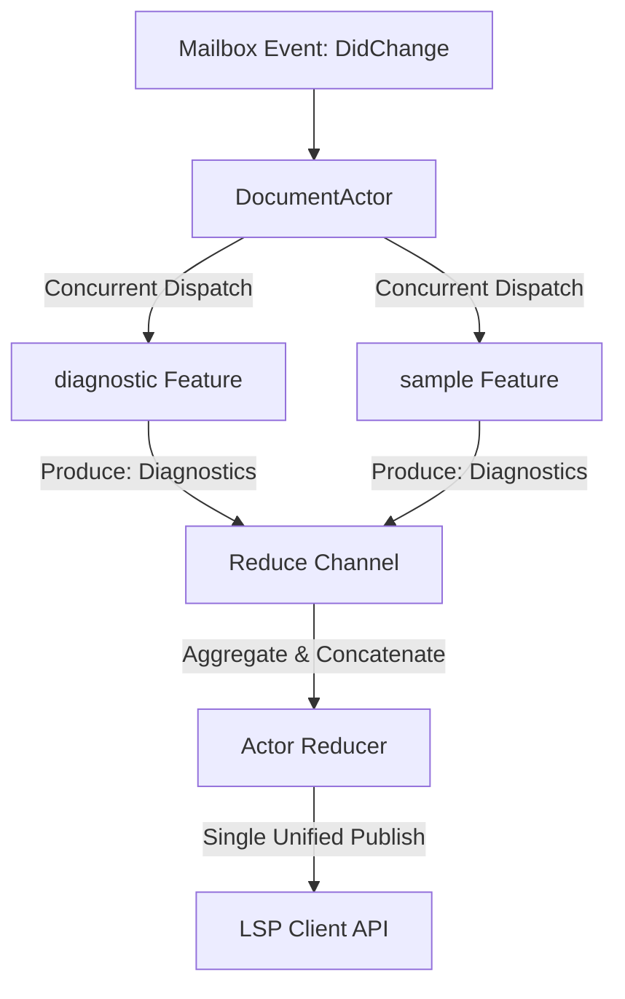

# System Specification: Generic Attribute API & Reduction Model

This document specifies the **Generic Attribute API**, the **Reduction Model**, and the **Direct Channel Sync** communication pattern used to integrate and orchestrate features inside the `DocumentActor`.

---

## 1. Overview & Objective

To prevent features from tightly coupling with the `DocumentActor` orchestrator, we define a highly generic, extensible, and clean interface: the **Generic Attribute API**. 

This API allows multiple separate features (for example, the `diagnostic` feature and the `sample` feature) to independently generate the same document attributes (like `Diagnostics`). The `DocumentActor` aggregates, concurrency-runs, and **reduces** (merges) these identical attribute types into a single response, making it trivial to add or extend features in the future.

---

## 2. The Generic Attribute API

All features that calculate and produce document properties (Diagnostics, Inlay Hints, Code Lenses) implement the `AttributeProducer` interface:

```go
package features

type AttributeType string

const (
    AttributeDiagnostics AttributeType = "diagnostics"
    AttributeInlayHints  AttributeType = "inlayhints"
    AttributeCodeLenses  AttributeType = "codelenses"
)

// AttributeProducer is implemented by asynchronous/state-contributing features.
type AttributeProducer interface {
    // Unique name of the feature (e.g. "sample", "diagnostic")
    Name() string
    
    // List of events this feature is interested in (e.g. DidOpen, DidChange)
    InterestedEvents() []meta.HandlerEvent
    
    // The attribute types this feature contributes to (e.g. AttributeDiagnostics)
    ProducedAttributes() []AttributeType
    
    // Calculates the specific attribute value asynchronously
    ProduceAttribute(event meta.HandlerEvent, payload EventPayload) (AttributeResponse, error)
}

type AttributeResponse struct {
    Type  AttributeType
    Value any // E.g., []protocol.Diagnostic, []protocol.InlayHint
}
```

---

## 3. Orchestration & Concurrency reduction

When the `DocumentActor` receives a lifecycle event (like `DidChange`), it executes the reduction loop:



### The Reduction Lifecycle
1. **Filtering by Event**: The `DocumentActor` filters the registered `AttributeProducer` list, invoking only those interested in the incoming event.
2. **Concurrent Invocation**: The actor triggers their `ProduceAttribute` methods concurrently over channels.
3. **Response Aggregation**: The actor listens on a shared reduction channel, gathering outputs as they arrive.
4. **Unified Reduction**: Once all interested producers reply, the actor runs the reducer matching the `AttributeType`:
   * **Diagnostics Reducer**: Concatenates compilation diagnostics (from `diagnostic` feature) and sample directive diagnostics (from `sample` feature) into a single slice, then publishes it.
   * **Inlay Hints Reducer**: Merges before-and-after expression values (from `sample` feature) and publishes/returns them.
   * **Code Lenses Reducer**: Combines sample open links and truncated output buttons into a unified list.

---

## 4. Direct Synchronous Feature Listeners

Unlike state-contributing features that require actor-level reduction, purely **query-response synchronous features** (such as `Hover` and `Completion`) bypass the reduction pipeline.

* **Pattern**: These features listen directly to a dedicated query channel dispatched by the `DocumentActor` goroutine.
* **Mechanism**: When `Hover` is called, the actor routes the query payload straight to the `hover` feature's input channel. The hover feature executes synchronously on its own processing loop, writing the response directly back to the handler's synchronous response channel.

---

## 5. Nonce Filtering & Zero-Context-Cancellation Rules

### Microsecond Execution (No Cancellation overhead)
> [!IMPORTANT]
> Because AST traversal, Benthos env parses, and sample evaluations complete in **microseconds** (strictly under 5ms), **Context Cancellation is completely omitted**. 
> - Setting up, propagating, and tearing down `context.Context` cancellation channels for microsecond operations adds massive runtime complexity and execution overhead.

### Stale Response Dropping via Nonces
To handle race conditions from rapid typing without cancellation:
1. The outer handler stamps every synchronous request with an incrementing **Nonce** (unique transaction transaction ID).
2. The `DocumentActor` passes this nonce through the feature channel pipeline.
3. When the reduced response is returned to the handler, the handler checks if the response's nonce matches the document's most current outstanding nonce.
4. If a newer request has already been registered, the handler **drops the stale response** quietly, returning nothing to the client. This guarantees editor consistency with zero context cancellation latency.
