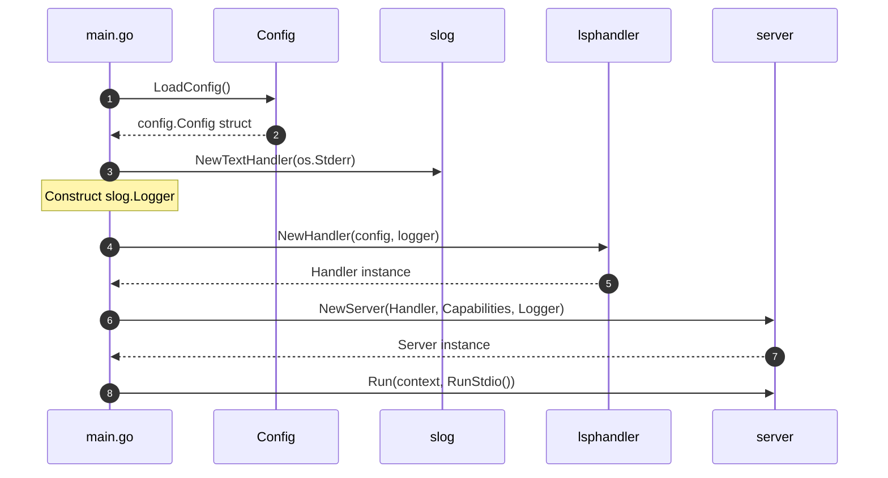

# Module Specification: Language Server Entrypoint (`main.go`)

This document specifies the design, responsibilities, constraints, and sequence flows of the language server entrypoint (`cmd/language-server/main.go`).

---

## 1. Overview & Purpose

`main.go` is the bootstrap entrypoint for the `bloblang-lsp` modular server. Its sole purpose is to load configuration, set up structural logging, construct the core LSP handler, declare top-level capabilities, and launch the JSON-RPC communication channel.

---

## 2. Bootstrapping Sequence Flow

---

## 3. Responsibilities

The entrypoint must perform the following tasks:

### 1. Configuration Loading
* Invoke `config.LoadConfig()`. If an error occurs, print it and terminate with `log.Fatal`.
* Standard environment variables (`BLOBLANG_LSP_*`) and `.bloblangrc` are processed implicitly.

### 2. Structured Logging Setup
* Extract the log level from `config.LogLevel` (supporting `debug`, `info`, `warn`, `error`).
* Instantiate a `slog.Logger` wrapping `slog.NewTextHandler(os.Stderr)`.

### 3. Outer Handler Construction
* Construct the `lsphandler` with `lsphandler.NewHandler(cfg, logger)`.

### 4. Capabilities Announcement
* Instantiate `server.NewServer` specifying standard JSON-RPC capabilities:
  * **Trigger Characters**: Define character triggers for completions (e.g. `"."`, `"@"`, `"$"`).
  * **Execute Commands**: Announce the command namespace IDs (e.g. `"bloblang/showResult"` and `"bloblang/openFile"`).

### 5. Transport execution
* Trigger the Stdio RPC transport stream via `s.Run(context.Background(), server.RunStdio())`.

---

## 4. Key Constraints & Rules

### What is EXPECTED
* **Pure Stdio separation**: All server logs must go to `os.Stderr`. Any prints to `os.Stdout` will corrupt the JSON-RPC standard protocol parsing and crash client-server synchronization.
* **Separation of concerns**: Keep the main loop clean. The entrypoint should never reference AST nodes, sample parsing, or feature packages directly.

### What is FORBIDDEN
* **No Feature-Specific Logic**: Never import features (like autocomplete, validation, or code lenses) in `main.go`. They must be handled inside their respective modules.
* **No Global Variables**: Never define package-level mutable variables. State must reside cleanly within initialized structs.
